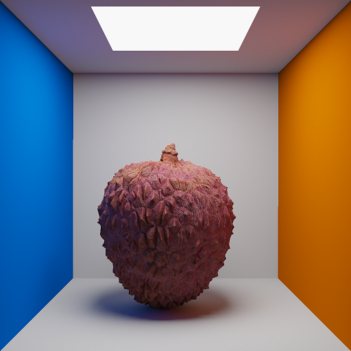

## raytracer-cpp

A WIP pathtracing rendering engine written in C++.

### Features
-  Multithreaded Rendering
-  Next Event Estimation
-  Binned SAH BVH
-  Diffuse Materials
-  Texture Mapping
-  Normal Mapping
-  GLTF import

